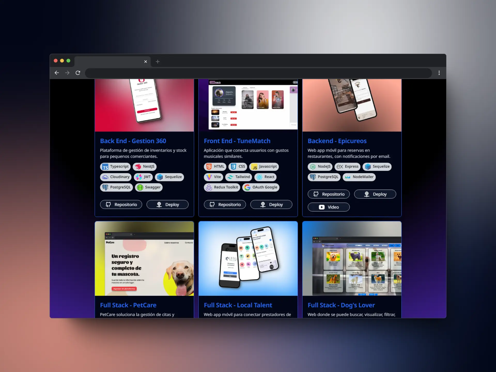
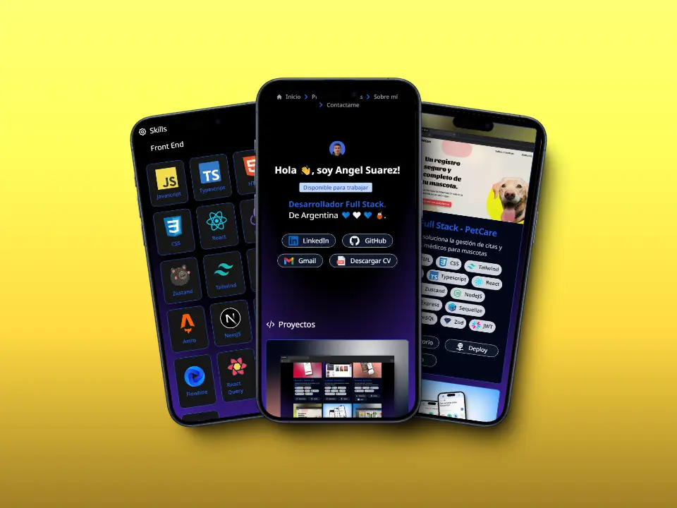

# Portfolio AAS

  

Este es el repositorio de mi portafolio personal creado con **Astro**. Este proyecto muestra mis habilidades, proyectos, y experiencia como desarrollador.

  

<div  style="display: flex; justify-content: center; gap: 24px; flex-wrap: wrap;">





</div>

  
  

## Descripción

Este portafolio fue desarrollado para destacar mis proyectos y habilidades como desarrollador Full Stack. Utilicé Astro por su capacidad para crear sitios web rápidos y accesibles, mientras que TailwindCSS me permitió diseñar una interfaz de usuario moderna y responsiva. TypeScript asegura que el código sea robusto y fácil de mantener a medida que el proyecto crece. Además, empleé Flowbite para componentes UI, Bun como gestor de paquetes rápido, y usé HTML5 y CSS3 para estructurar y estilizar el contenido del sitio.

  

## Tecnologías Utilizadas

- 

- 

- 

- 

- 

- 

- 


## Deploy

[Hacer clic aquí para ver mí Portafolio ](https://portafolio-aas.netlify.app/)

## Scripts Disponibles

  

-  **`dev`**: Inicia el servidor de desarrollo.

-  **`start`**: Alias para `astro dev`.

-  **`build`**: Verifica el proyecto y luego crea la versión optimizada para producción.

-  **`preview`**: Previsualiza el proyecto después de ser compilado.

-  **`astro`**: Ejecuta comandos de Astro directamente.

  

## Instalación

  

Para ejecutar este proyecto en tu entorno local, sigue estos pasos:

  

1. Clona el repositorio:

```bash

git clone https://github.com/AngelBlackBlue/porfolio-aas.git

```
2. Instala las dependencias:
```bash

npm install

```
3. Inicia el servidor de desarrollo:
```bash

npm run dev

```


